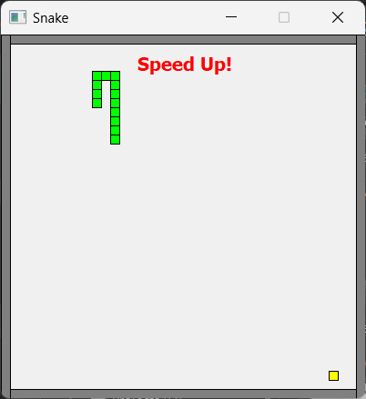

# Игра "Змейка"

*Реализация игры "Змейка" на C++ с использованием фреймворка Qt5*

**Работа нацелена на начинающих программистов*

### Возможности

- Управление стрелками клавиатуры
- Генерация "еды"
- Обработка столкновений со стенками и самопересечения
- Увеличение скорости каждые 10 очков (выводится сообщение об увеличении скорости)

### Необходимые зависимости:

- Qt5
- CMake

### Сборка

Клонируем репозиторий с гита:
```bash
git clone https://github.com/Shaman-dp/snake-cpp.git
```
Заходим в папку проекта и создаем папку сборки `build`:
```bash
cd snake-cpp
mkdir build && cd build
```
Собираем проект:
```bash
cmake ..
make
```
Запускаем приложение:
```bash
./main
```

### Скриншоты




### Developer
<depos_dev@mail.ru>  
*Dmitri Posvyashenyi*